# Transportcompany
# Transportcompany
<b><u>Objective</b></u> 
It maintains all the information about any vehicle that is administered in a transport company with the sufficient details including the details of: the vehicle’s owner, contact number and the Insurance details along with all the available transport services that is provided by the company.

<b>Users of system</b> 
<ul><li>Admin</li><li>Employee</li></ul>
<b>Functional Requirements</b> 
<ul><li>Admin</li>
1.	Can login and logout.  
2.	Can add new login user detail.  
3.	Can view usser detail.  
4.	Can update user detail .  
5.	Can view vehicle details.  
 
<li>Employee</li>
1.		Can add  new vehicle detail.  
2.	Can view current used vehicle detail.  
3.	Can view user Address. 
4.Can view user names,email all detail.  
</ul>
<b>Tools Used</b> 
1.	jsp and javascript  
2.	Os:-Windows 10 
3.  Backend:-Mysql 
4.  Front End:-Html and css  
5.  Database Connectivity:-JDBC 
   
<b>Working of Project with Screenshots</b> 
First page:- you have login   
 
This is the home page of the application, there are five button on it clicking the buttons will open a new  page and current page will be closed.  
If user id and password is correct then:- 
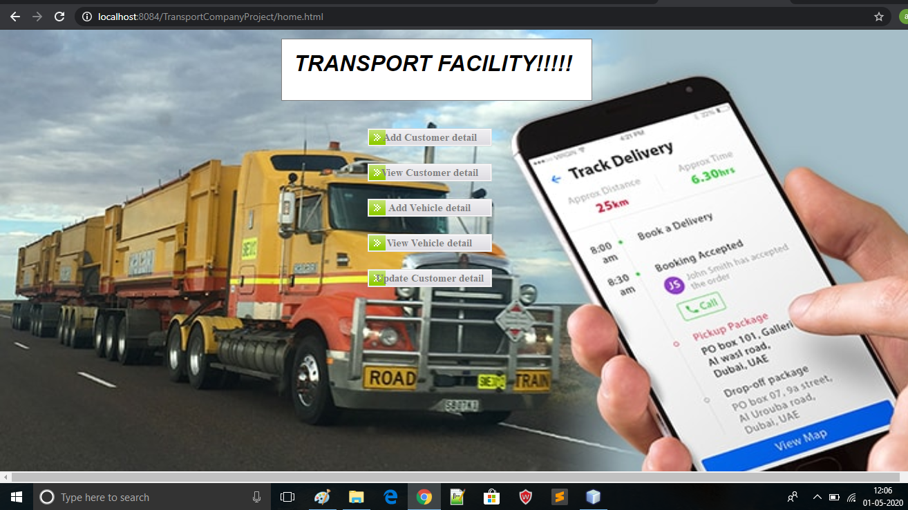 
Then the next page is inquiry form 
Name, mobile no. and Address is fill then go to “submit” button 
 
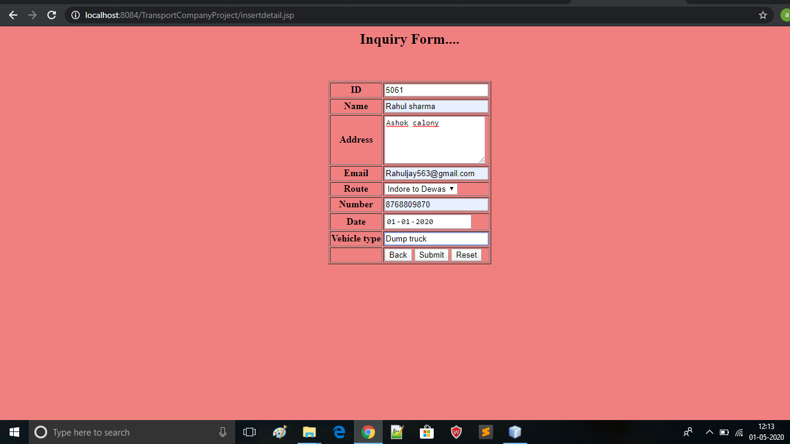 
after filling all detail inserted message will display
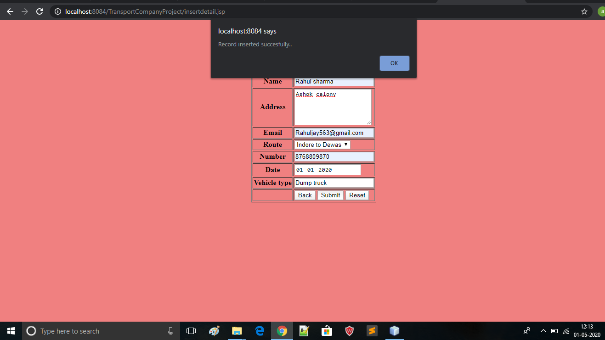 
On click on view  button it display all record:- 
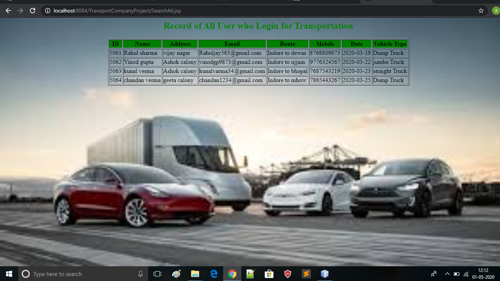 
 On click on add vehicle detail button:-  
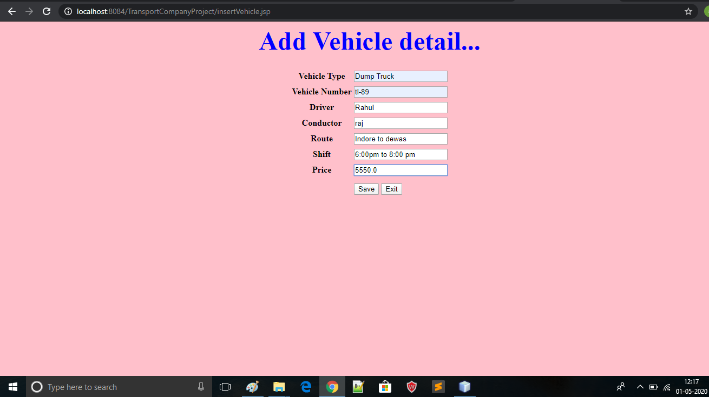 
after save all this infomation save message will appear:-  
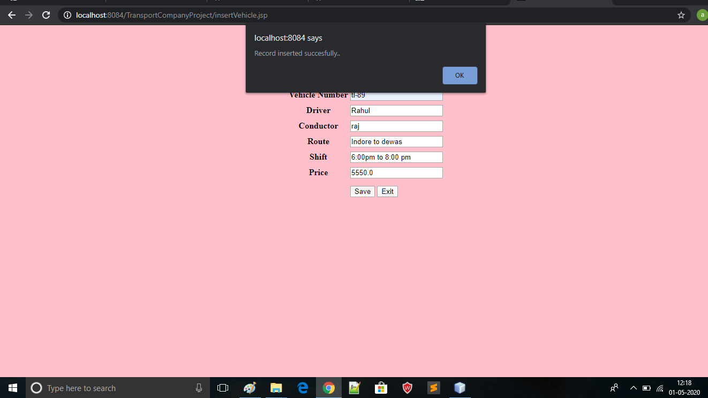 
On click on view button information of current vehicle will show:-  
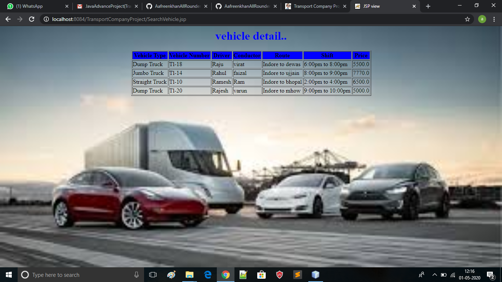 
On click on update button it require id :-  
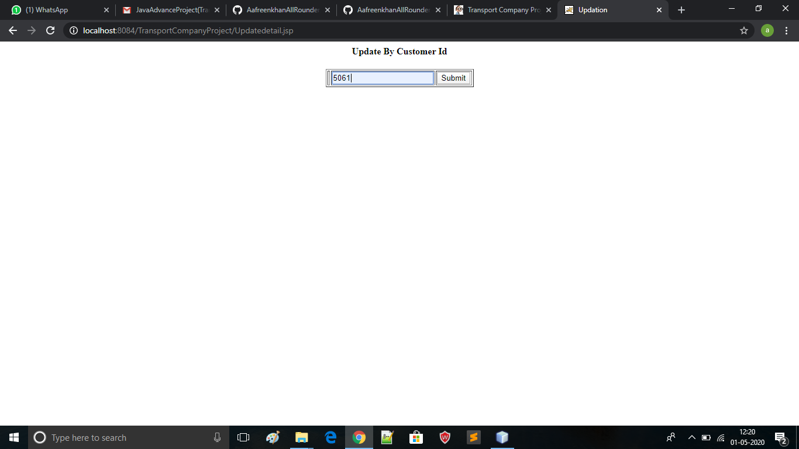 
On click on update button if given id is correct it show record of that user whose information want to update:-  
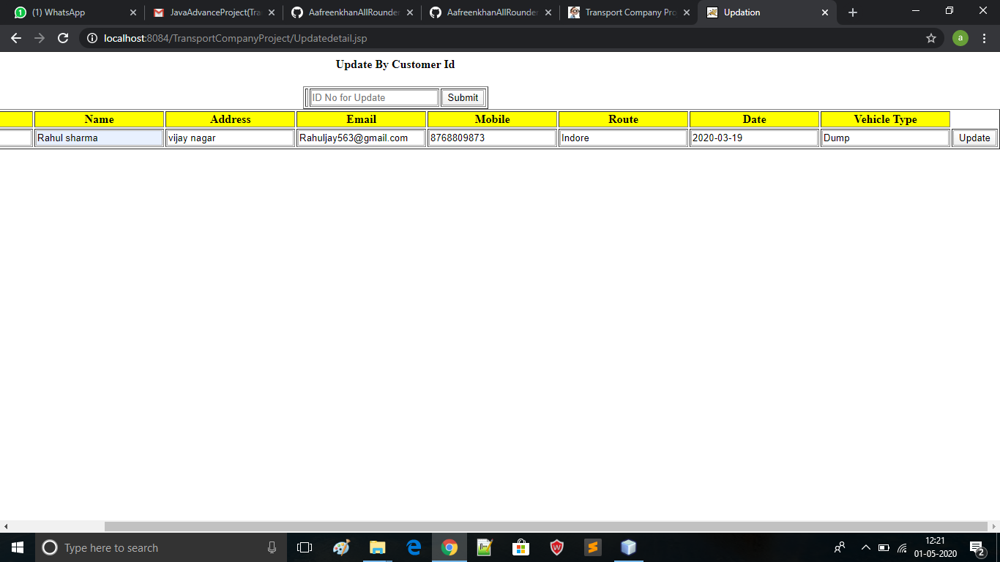 
On click on update record will be updated:- 
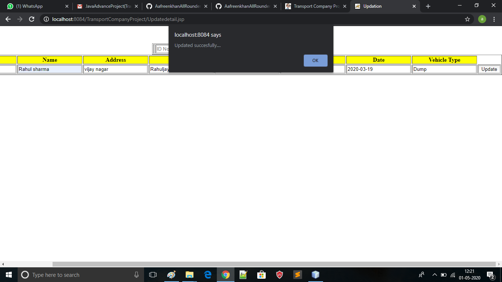 

<b>Class Diagram</b> 
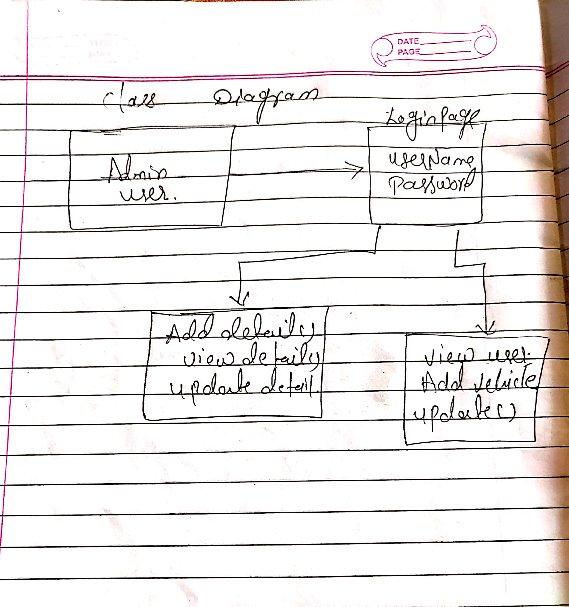 
<b>ER Diagram</b> 
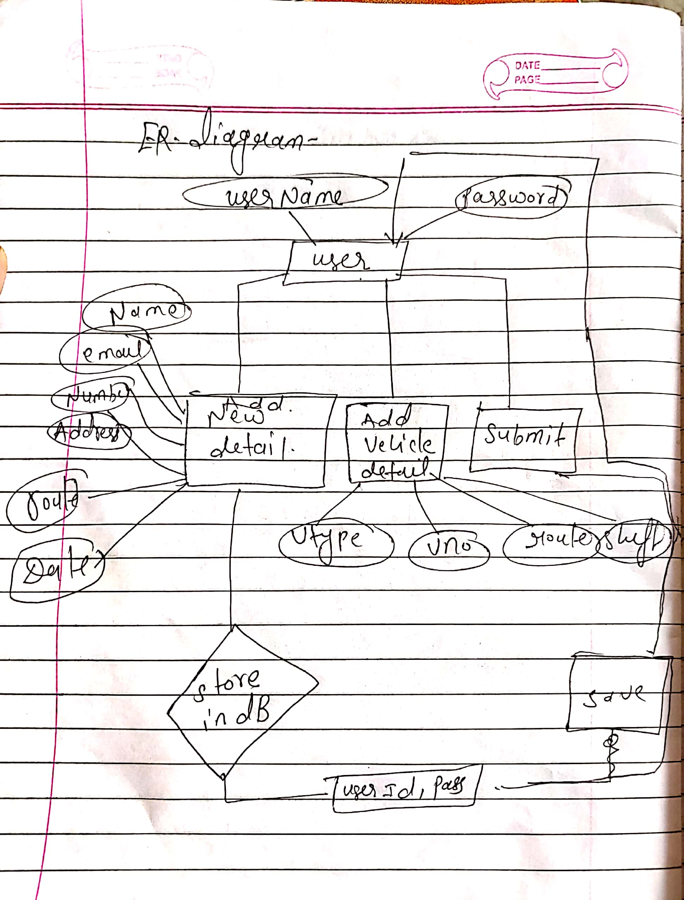 
<b>Data Flow Diagram</b> 
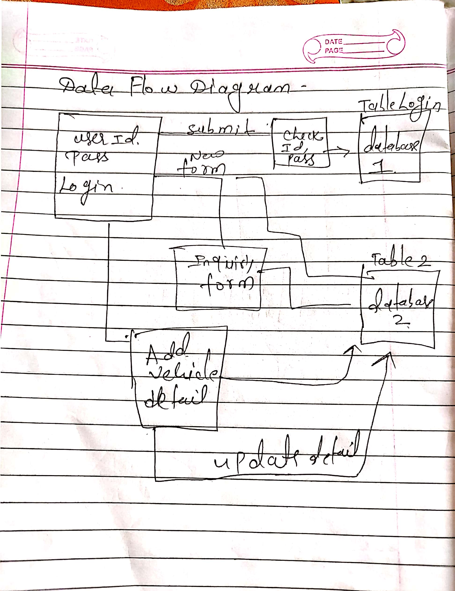 
